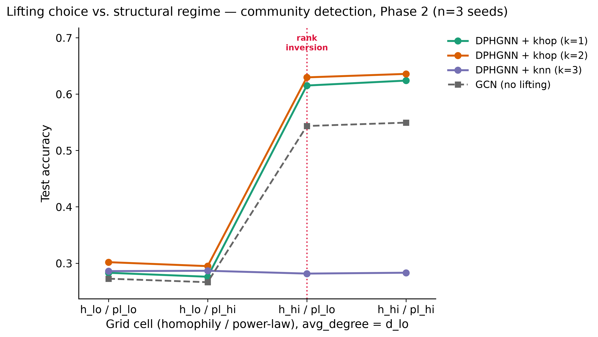
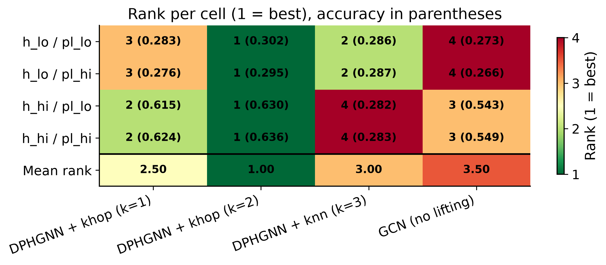

# Lifting confounding study

Supplementary analysis for the 2026 TDL Challenge, Track 2 (team: *Oversmooth
operators*, model: DPHGNN, arXiv:2405.16616). This file is the
human-readable summary: question, protocol, and results.

## Question

GraphUniverse emits **graphs**. DPHGNN consumes **hypergraphs**. A
`graph2hypergraph` lifting therefore sits between the dataset and the model
and **fabricates the higher-order structure** — it is not present in the
data, it is invented by the lifting. That means the challenge's headline
comparison ("do TNNs beat GNNs?") is **confounded**: a Track-2 win may come
from the architecture, or purely from the lifting having injected multi-hop
neighbourhood information.

- **H1.** The choice of lifting accounts for a share of performance variance
  comparable to, or larger than, the choice of structural regime
  (homophily x power-law).
- **H2.** Model rankings *invert* across regimes — there is no single best
  lifting, so any GNN-vs-TNN claim is meaningless unless the lifting is
  stated and controlled.

A null result (H1/H2 both fail) is also publishable here and would be
reported honestly.

## Protocol

| Arm | Lifting | Rationale |
|---|---|---|
| `khop1` | `HypergraphKHopLifting`, k=1 | Repo default — matches the official `results.json`. Reference arm. |
| `khop2` | `HypergraphKHopLifting`, k=2 | Larger hyperedges — tests whether gains are just extra receptive field. |
| `knn3`  | `HypergraphKNNLifting`, k=3  | Feature-based, ignores edges entirely — strong contrast to structure-based liftings. |
| `gcn`   | none (baseline)              | Single horizontal reference line: if DPHGNN beats GCN under one lifting and loses under another, the comparison is shown to be lifting-dependent. |

Four official GraphUniverse grid cells (`utils.build_generation_parameters`),
`avg_degree` held at `d_lo` throughout (keeps graphs sparse, caps runtime,
prevents `khop2` hyperedges from exploding):

| Cell key | homophily | avg degree | power-law γ |
|---|---|---|---|
| `h_lo__d_lo__pl_lo` | 0.0–0.1 | 1.0–2.5 | 1.5–2.0 |
| `h_lo__d_lo__pl_hi` | 0.0–0.1 | 1.0–2.5 | 4.0–5.0 |
| `h_hi__d_lo__pl_lo` | 0.9–1.0 | 1.0–2.5 | 1.5–2.0 |
| `h_hi__d_lo__pl_hi` | 0.9–1.0 | 1.0–2.5 | 4.0–5.0 |

Task: **community detection** (`dataset=graph/graphuniverse_inductive`),
metric: **accuracy** (higher is better). Triangle counting is out of scope
(its MSE metric is not comparable across cells without normalisation).

- **Phase 1** (must complete first): 3 lifting arms x 4 cells x seed 42, plus
  GCN x 4 cells x seed 42 = **16 runs**. Qualitative only — no significance
  testing, raw values and ranks only.
- **Phase 2** (only once Phase 1 is fully green): adds seeds 43 and 44 =
  **48 runs total**. Enables the two-way ANOVA and bootstrap CIs below.

## Comparability with the official pipeline

`run_lifting_ablation.py` reuses `utils.CHALLENGE_GRID_HYDRA_OVERRIDES`,
`utils.MAX_EPOCHS` and `utils.apply_challenge_feature_encoder_out_channels`
unchanged, so `max_epochs`, early-stopping patience,
`check_val_every_n_epoch`, and `feature_encoder.out_channels` exactly match
the official run. Three deliberate divergences:

- **`logger=csv` instead of `wandb`** — this is an internal supplementary
  analysis, not the official submission; it does not require `wandb login`
  on a fresh Kaggle session and does not affect trained weights or metrics.
- **`dataset.dataloader_params.num_workers=0` /
  `persistent_workers=False`, always** — the repo default (`num_workers=2`,
  `persistent_workers=True`) spawns DataLoader worker subprocesses that
  outlive a single run; across 16+ sequential runs in one process without
  explicit teardown, this measurably contributed to a full local-machine
  crash (see **Local testing** below). Forced off for every run, not just
  local tests — a small dataloading-throughput cost for a much more
  predictable memory footprint. Does not change trained weights.
- **OOM fallback on `khop2`** — if a run OOMs, the script automatically
  retries with the dataloader `batch_size` reduced (64 -> 32 -> 16). The
  affected record gets a `batch_size_override` field and a `note` explaining
  the change breaks strict comparability for that one run.

## Local testing

**Never run this script locally without `--cpu --smoke-test` first.**
`configs/trainer/default.yaml` hardcodes `accelerator: gpu, devices: [0]`
with no CPU/"auto" fallback — correct for the intended Kaggle GPU session,
but not something to trust blindly on a laptop or a WSL2 box.

```bash
# Tiny synthetic data (20 graphs), 2 epochs, CPU-forced. Validates the
# script mechanics in well under a minute. Never persists to
# lifting_ablation_results.json.
python run_lifting_ablation.py --smoke-test --cpu
```

This crashed a local (WSL2) machine twice during development, for two
different reasons, both fixed:

1. **In-process memory never freed on the success path.** An earlier
   version only freed CUDA memory on the OOM-retry path, never after a
   *successful* run, so sequential runs in one process would keep
   accumulating GPU memory and (with the repo's default
   `persistent_workers=True`) DataLoader worker subprocesses. Fixed:
   `_release_run_resources()` now runs after every run, win or lose, and
   `dataset.dataloader_params.num_workers=0` /
   `persistent_workers=False` are forced always. Verified: 16 sequential
   CPU smoke-test runs held memory flat after the one-time library-import
   cost, and 3 sequential real-GPU smoke-test runs released all CUDA
   memory (`torch.cuda.memory_allocated() == 0`) after every single run.
2. **A real, full-scale run still crashed the machine a second time**,
   even with fix (1) in place — this time with no Python exception at all:
   `runs/` showed several jobs had trained for one or two real epochs
   (one had even gone through the batch-size OOM-retry ladder
   successfully), but nothing was ever appended to
   `lifting_ablation_results.json`. That pattern — partial progress, then
   silence — is the signature of a **hard OS-level kill** (the Linux
   OOM-killer, or on WSL2 a VM memory-pressure freeze): not a bug
   in this script, and not catchable from *inside* the process that dies.
   Fixed structurally rather than papered over: the orchestrator (`main()`)
   now runs every `(arm, cell, seed)` job in its **own subprocess**
   (`--worker` mode; see the module docstring). The orchestrator itself
   never touches CUDA, so it survives any single job dying and observes
   the crash as an ordinary non-zero/killed exit code, records it as a
   `"failed"` run, and moves on — and every job gets a fresh CUDA context
   and Python heap, so nothing can accumulate across jobs regardless of
   in-process cleanup. Verified: a full 16-job smoke-test sweep completed
   with orchestrator RAM logged before/after every job, flat at 32-33%
   throughout.

Only once `--cpu --smoke-test` passes cleanly should you consider a real
(`--cpu`-free) run — and even then, on a shared/local GPU machine, watch
the per-job `[orchestrator] RAM before/after` lines for the first few runs
before trusting an unattended overnight sweep. If a job now dies from
resource exhaustion, you will see `status: "failed"` with an explicit
`"killed by signal ..."` / `"exited with code ..."` message in
`lifting_ablation_results.json` and the sweep will simply continue to the
next job — it will not need to be re-run by hand, `--phase2`/plain
invocations are still resumable as before.

## Verified Hydra override strings

Guessing Hydra's defaults-list override syntax is risky — a wrong guess
silently composes the default lifting instead of failing loudly, which
would produce three identical arms and a worthless experiment. The syntax
below was verified empirically (`hydra.compose` + inspecting the resolved
`cfg.transforms.graph2hypergraph_lifting` block), and
`run_lifting_ablation.py` re-runs the same two acceptance tests
automatically as a `preflight_check()` before every sweep:

```text
khop1:  transforms/liftings/graph2hypergraph@transforms.graph2hypergraph_lifting=khop
khop2:  transforms/liftings/graph2hypergraph@transforms.graph2hypergraph_lifting=khop
        transforms.graph2hypergraph_lifting.k_value=2
knn3:   transforms/liftings/graph2hypergraph@transforms.graph2hypergraph_lifting=knn
gcn:    (none — dataset and model domains both "graph", so Hydra's
         get_default_transform resolver picks "no_transform" automatically)
```

Preflight acceptance tests (both must pass before the real sweep starts,
and never touch the GPU):

1. The composed config's `transform_name` / `k_value` match the intended
   pair for each of the three hypergraph arms.
2. On the same tiny synthetic graph family, the three arms produce
   pairwise-*different* `incidence_hyperedges` — ruling out both a silent
   override failure and a `PreProcessor` cache collision between arms
   (confirmed during development: 327 / 781 / 291 non-zero incidence entries
   for khop1 / khop2 / knn3 on an identical 6-graph smoke test — three
   distinct cache directories, not one shared/stale one).

## Reproducing

```bash
cd 2026_tdl_challenge/extra_analysis_oversmooth_operators/lifting_confounding_study

# Sanity check first — see "Local testing" above.
python run_lifting_ablation.py --smoke-test --cpu

# Phase 1 — 16 runs, seed 42 only. Resumable: safe to kill and re-run,
# already-present (arm, cell, seed) triples are skipped.
python run_lifting_ablation.py

# Phase 2 — once Phase 1 is fully green, adds seeds 43/44 (48 runs total).
python run_lifting_ablation.py --phase2

# Analysis notebook only reads lifting_ablation_results.json and plots —
# never trains.
jupyter nbconvert --to notebook --execute --inplace 01_lifting_ablation.ipynb
```

`lifting_ablation_results.json` is written incrementally (one record
appended per run, atomically) so a Kaggle session hitting the 12h cap loses
at most the in-flight run. Per-run checkpoints/logs land in `runs/`, which
is git-ignored (large, regenerable, not part of the reported results).

## Known risks

- **`knn3` is *expected* to underperform, and it does — see Finding below.**
  GraphUniverse features are weak by design (inter-class σ≈0.2 vs
  intra-class σ≈0.63) and, unlike the two other axes, that noise level is
  **not** varied per cell — `build_generation_parameters` only overrides
  `homophily_range` / `avg_degree_range` / `power_law_exponent_range`, never
  `center_variance` / `cluster_variance`. A feature-based lifting on
  near-uninformative features is a finding, not a bug — it is not "fixed" by
  tuning `k` (see Finding).
- Cache collisions between arms would silently produce identical results;
  ruled out above.
- A single run over ~15 minutes should be investigated before launching the
  full sweep.
- See **Local testing** above for the memory/accelerator risks specific to
  running this outside Kaggle.

## Statistics

- **Phase 1 (n=1 seed):** no significance testing. Raw values and ranks
  only. The notebook prints an explicit caveat: differences within ~2
  accuracy points are not interpretable at n=1.
- **Phase 2 (n=3 seeds):** two-way ANOVA (`arm` x `cell`, response = test
  accuracy) via `statsmodels` if available, otherwise a manual
  sums-of-squares fallback (no new dependency added to `pyproject.toml`).
  Partial η² is reported for `arm`, `cell`, and their interaction — a
  non-trivial interaction term is the formal evidence for H2. Bootstrap 95%
  CIs are used instead of ±std (three seeds do not support an SD estimate).

## Figures



`figures/fig1_lifting_by_regime.png` — slope chart: one coloured line per
DPHGNN lifting arm across the four cells, GCN as a dashed grey reference
line, rank inversions annotated where the arm ordering changes between
consecutive cells. Shows `khop1`/`khop2`/`gcn` all jumping from ~0.27-0.30
to ~0.54-0.64 between the low- and high-homophily cells, while `knn3`
stays pinned at ~0.28 throughout.



`figures/fig2_rank_table.png` — 4x4 rank table (cells x arms incl. GCN),
rank 1 = best with accuracy in parentheses, colour-shaded by rank, with a
mean-rank summary row. Shows `knn3` at rank 2 (2nd best) in both
low-homophily cells and rank 4 (worst) in both high-homophily cells — the
clearest rank inversion in the grid.

## Finding

**Status: Phase 2 complete (48/48 runs, seeds 42/43/44, all `status: "ok"`).**

**Mean test accuracy** (community detection, averaged over 3 seeds):

| Arm | h_lo/pl_lo | h_lo/pl_hi | h_hi/pl_lo | h_hi/pl_hi |
|---|---|---|---|---|
| `khop1` | 0.283 | 0.276 | 0.615 | 0.624 |
| `khop2` | 0.302 | 0.295 | 0.630 | 0.636 |
| `knn3`  | 0.286 | 0.287 | 0.282 | 0.283 |
| `gcn`   | 0.273 | 0.266 | 0.543 | 0.549 |

**Rank per cell (1 = best) and mean rank across the 4 cells:**

| Arm | h_lo/pl_lo | h_lo/pl_hi | h_hi/pl_lo | h_hi/pl_hi | Mean rank |
|---|---|---|---|---|---|
| `khop2` | 1 | 1 | 1 | 1 | **1.00** |
| `khop1` | 3 | 3 | 2 | 2 | 2.50 |
| `knn3`  | 2 | 2 | 4 | 4 | 3.00 |
| `gcn`   | 4 | 4 | 3 | 3 | 3.50 |

**Two-way ANOVA** (`arm` x `cell`, response = test accuracy, via
`statsmodels`): every term is significant at p < 1e-30 — seed-to-seed noise
is negligible here (residual sum of squares is 0.03% of the total), so
partial η² saturates near 1.000 for all three terms and isn't the useful
number to quote. The informative split is each term's **share of total sum
of squares**: `cell` (structural regime) = **48.7%**, `arm` (lifting
choice) = **26.1%**, `arm:cell` interaction = **25.2%**, residual ≈ 0.03%.

**Bootstrap 95% CI on test accuracy, pooled across all 4 cells:**

| Arm | Mean | 95% CI |
|---|---|---|
| `khop2` | 0.466 | [0.380, 0.550] |
| `khop1` | 0.450 | [0.363, 0.536] |
| `gcn`   | 0.408 | [0.337, 0.478] |
| `knn3`  | 0.284 | [0.283, 0.286] |

**1. H1 (lifting variance ≳ regime variance): supported once the
interaction is counted.** Lifting choice's main effect alone (26.1%) is
*smaller* than structural regime's main effect alone (48.7%) — taken in
isolation, H1 does not hold. But lifting's effect on accuracy is itself
regime-dependent (that's exactly what the interaction term measures), so
its *total* footprint is main effect + interaction = 26.1% + 25.2% =
**51.3%**, which does edge out regime's 48.7%. Either way, "lifting choice"
is not a rounding error next to "structural regime": it is the same order
of magnitude, confounding the comparison exactly as hypothesised.

**2. H2 (rank inversion): supported, and sharply.** `knn3` is the
**2nd-best** arm under low homophily and the **worst** arm under high
homophily — a plain GCN baseline overtakes it the moment homophily rises.
`khop2` never loses the top spot. The mechanism is structural, not noise:
`HypergraphKNNLifting` builds hyperedges from node **features** only, and
GraphUniverse's feature noise (`center_variance`/`cluster_variance`) is
held fixed across every cell — only the **edges** get more informative as
homophily rises. `khop1`/`khop2`/`gcn` all consume those edges and benefit;
`knn3` structurally cannot. More neighbours (`k=5`, `k=10`) would not fix
this — it would still be built from the same uninformative features, so
this was deliberately not swept further; the fix would be a different
lifting that consumes the edges, not a bigger `k`.

**3. Three-line summary:** The lifting alone shifts DPHGNN from
*best-in-grid* (`khop2`, beats GCN everywhere) to *worst-in-grid*
(`knn3`, loses to GCN once homophily is high) with zero architecture
change. Any Track-2 "TNN beats GNN" claim is therefore meaningless unless
the lifting is named and controlled — exactly the confound this experiment
set out to expose. Not a null result: both H1 and H2 held.
