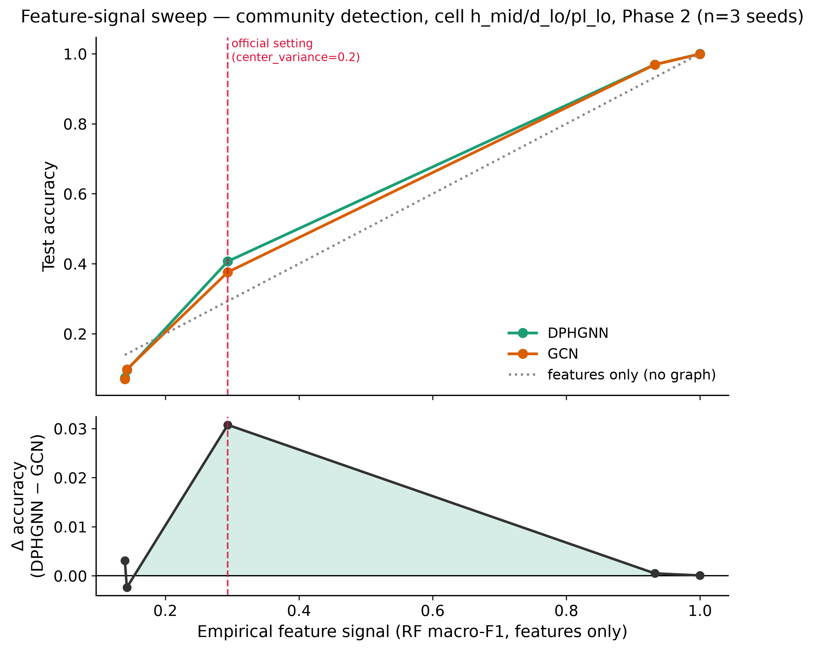

# Experimentation 3 — Feature-signal sweep

Supplementary analysis for the 2026 TDL Challenge, Track 2 (team: *Oversmooth
operators*, model: DPHGNN, arXiv:2405.16616). This file is the
human-readable summary: question, protocol, and (once the Kaggle GPU sweep
has run) findings.

**Status: Phase 1 and Phase 2 complete (30/30 runs, seeds 42/43/44, all
`status: "ok"`), run on Kaggle GPU via `kaggle_run_feature_signal.ipynb`.**
Every acceptance test, the preprocessing-cache check, and the empirical
feature-signal diagnostic below were executed for real on this machine and
passed *before* the real sweep started. See "Results" and "Finding" below
for the outcome.

## Question

The official GraphUniverse grid varies three **structural** axes
(homophily, average degree, power-law exponent) and holds the **feature**
distribution fixed at `center_variance=0.2` (between-class σ≈0.2) and
`cluster_variance=0.4` (within-class σ≈0.63) — within-class spread is ~3x
the between-class spread. Features are weak by construction, and this is
never stated in the challenge materials.

- **H1.** There exists a crossover: at low feature signal, DPHGNN's
  higher-order structure gives a real advantage over a GNN; as feature
  signal rises, both converge and the advantage vanishes.
- **H2.** The official grid sits on the *left* side of that crossover — the
  whole challenge is conducted in a regime that structurally favours models
  that exploit topology. Establishing where the official point sits on the
  curve is a contribution in itself.

A flat curve (no crossover) is a legitimate and interesting null result.

## Protocol

**Swept:** `center_variance`, a **universe-level** parameter. Changing it
regenerates the whole latent universe — each point is a
genuinely different dataset, not a resample.

| Point | `center_variance` | Expected regime |
|---|---|---|
| `fs_00` | 0.02 | features ≈ pure noise |
| `fs_01` | 0.05 | very weak |
| `fs_02` | **0.20** | **official setting — reference point** |
| `fs_03` | 0.80 | features informative |
| `fs_04` | 2.00 | features nearly sufficient alone |

Everything else stays at `STANDARD_GENERATION_PARAMETERS` (including
`cluster_variance=0.4`).

**Structural cell (fixed, one only):** `h_mid__d_lo__pl_lo` — mid-homophily
(0.4-0.6), sparse (avg degree 1.0-2.5), heavy-tailed (power-law exponent
1.5-2.0). E3 varies features, not structure; a second cell would double
cost for little gain at this stage.

**Models (both mandatory):** `hypergraph/dphgnn` and `graph/gcn`. The
experiment is the *gap* between them.

Task: community detection only. Metric: accuracy (higher is better).

**Budget:**

- **Phase 1:** 5 points x 2 models x 1 seed (42) = **10 runs**.
- **Phase 2 (if time):** seeds 43, 44 -> 30 runs, enabling bootstrap CIs on
  the gap and a Spearman-ρ monotonicity test.

## The Hydra override mechanism (verified)

`center_variance` lives under `universe_parameters`, whereas the three
official structural axes live under `family_parameters` — a different path
from anything used in E1 or the official notebook. Guessing this path is
dangerous: a wrong path **silently composes the default value** instead of
failing, producing five identical datasets and a flat curve that looks like
a real null result.

`run_e3.py` never hand-writes the override string. It reuses
`utils.generation_parameters_to_hydra_overrides()`, which walks the nested
`{universe_parameters, family_parameters}` dict and emits one
`dataset.loader.parameters.generation_parameters.<group>.<key>=<value>`
override per key. For `center_variance` this resolves to:

```text
dataset.loader.parameters.generation_parameters.universe_parameters.center_variance=<value>
```

verified empirically for all 5 sweep points by `preflight_check()`'s
acceptance test A (below) — never assumed.

## Acceptance tests (blocking — run for real, locally)

Both live in `run_e3.py` as plain functions (`_acceptance_test_a`,
`_acceptance_test_b`, `_verify_cache_dirs_distinct`, all called from
`preflight_check()`), mirroring `lifting_confounding_study`'s
`preflight_check()` pattern. They never touch the GPU (no model/trainer is
built) and were run for real on this machine before any other work
proceeded.

**Test A (config level):** compose the Hydra config for each of the 5
points and assert the resolved
`dataset.loader.parameters.generation_parameters.universe_parameters.center_variance`
equals the intended value.

```text
fs_00: center_variance=0.02 OK
fs_01: center_variance=0.05 OK
fs_02: center_variance=0.2  OK
fs_03: center_variance=0.8  OK
fs_04: center_variance=2.0  OK
```

**Test B (data level, mandatory):** generate a small dataset (20 graphs,
30-60 nodes) at each of the 5 points and compute the ratio of
between-class to within-class variance of `data.x`, pooled over the
training split. Identical statistics across points would mean the override
never reached the feature generator.

| Point | `center_variance` | between/within variance ratio |
|---|---|---|
| `fs_00` | 0.02 | 0.035046 |
| `fs_01` | 0.05 | 0.040479 |
| `fs_02` | 0.20 | 0.131857 |
| `fs_03` | 0.80 | 1.567622 |
| `fs_04` | 2.00 | 9.576357 |

Strictly monotonically increasing across all 5 points (not just the
`fs_00`/`fs_04` pair the test formally requires) — a ~270x separation
between the extremes. **Test A and test B both passed.**

**Preprocessing-cache-directory check:** a
shared raw-data cache across points would silently reuse `fs_00`'s data for
every point — the data-level analogue of the test-B failure mode, verified
independently by listing the `GraphUniverseDatasetLoader` raw directory for
each point:

```text
fs_00: .../n_graphs_20_n_nodes_30_to_60/n_communities_5_to_10/task_community_detection/hash_306f24de...22a
fs_01: .../n_graphs_20_n_nodes_30_to_60/n_communities_5_to_10/task_community_detection/hash_5eab008f...1db
fs_02: .../n_graphs_20_n_nodes_30_to_60/n_communities_5_to_10/task_community_detection/hash_0fb1d4ec...6f8
fs_03: .../n_graphs_20_n_nodes_30_to_60/n_communities_5_to_10/task_community_detection/hash_090a2a26...22a
fs_04: .../n_graphs_20_n_nodes_30_to_60/n_communities_5_to_10/task_community_detection/hash_c47e6ba1...10a
```

5/5 distinct hash directories, each containing its own `data.pt`. The hash
depends on the full generation-parameters dict (including
`center_variance`), so the same K/homophily/n_graphs/n_communities prefix
is shared but the leaf hash directory is not — confirmed by direct
inspection, not inferred.

## Step 0b — empirical feature-signal diagnostic (succeeded)

`graph_universe.GraphSample.calculate_feature_signal()` trains a
Random-Forest classifier on node features alone and reports macro-F1
against the true community label — an empirical, interpretable measure of
"how much of the label is recoverable from features alone" (0 = chance,
1 = perfect).

Those `GraphSample` objects are **not** reachable through the TopoBench
loader: `GraphUniverseDataset.download()` (in the `graph_universe` package)
builds a `GraphFamilyGenerator`, calls `generate_family()`, converts the
result to PyG `Data` via `to_pyg_graphs()`, and discards the
`GraphFamilyGenerator`/`GraphSample` objects — nothing survives past
`download()` except the collated PyG tensors. Refactoring the loader to
smuggle them out was ruled out ("do not refactor the loader to reach
them").

Instead, `compute_empirical_feature_signal_all_points()` in `run_e3.py`
calls `graph_universe`'s own public API a **second time**, directly, with
the exact same `generation_parameters` used for each sweep point
(`GraphUniverse(**universe_parameters)` +
`GraphFamilyGenerator(universe=..., **family_parameters)`), on a small
independent probe family (30 graphs), and averages
`calculate_feature_signal()` over them. This is not a loader hack — it is
the same generation call the loader makes internally, invoked a second
time purely for the diagnostic, and it took well under the 30-minute
timebox (~20s/point):

| Point | `center_variance` | mean `feature_signal` (n=30 graphs) | std |
|---|---|---|---|
| `fs_00` | 0.02 | 0.139 | 0.051 |
| `fs_01` | 0.05 | 0.142 | 0.059 |
| `fs_02` | 0.20 | 0.293 | 0.101 |
| `fs_03` | 0.80 | 0.932 | 0.066 |
| `fs_04` | 2.00 | 1.000 | 0.000 |

**Step 0b succeeded** and gives a clean, monotonic empirical x axis. Cached
in `feature_signal_empirical.json`; the analysis notebook and figure use it
as the x axis automatically when present, falling back to `center_variance`
(log scale) otherwise. The official setting (`fs_02`) sits at
`feature_signal ≈ 0.29` — i.e. even the RF upper bound on "features alone"
only explains ~29% macro-F1 at the official operating point, confirming the
"features are weak by construction" premise in section 1 quantitatively,
independent of any trained TDL/GNN model.

## Dataset generation cost

Timed the first full-scale (`n_graphs=1000`, official
`STANDARD_GENERATION_PARAMETERS` size) universe generation +
collate/processing at `fs_00`, generation-only (no model/trainer built):

**`fs_00` full-scale generation + preprocessing: 252.2 s (~4.2 min).**

Each of the 5 `center_variance` points is a distinct universe (confirmed
above), so the raw generation cost is paid 5 times, not once — the two
models share the same raw dataset per point (only the downstream
`PreProcessor` transform/lifting differs), so this cost does **not**
double for the two-model sweep.

**Projected Phase-1 cost:** 5 x ~252 s ≈ **21 minutes** of dataset
generation/preprocessing alone, on top of actual GPU training time for the
10 runs (not measured locally — reserved for Kaggle). Phase 2 adds no new
generation cost (same 5 universes, more seeds only), so its overhead is
purely additional training: 30 runs total vs. 10 for Phase 1, i.e. ~3x the
Phase-1 GPU-training wall-clock, with the ~21 minutes of generation paid
only once (cached raw datasets are reused across seeds and phases).

## Comparability with E1 and the official pipeline

`run_e3.py` reuses `utils.CHALLENGE_GRID_HYDRA_OVERRIDES`, `utils.MAX_EPOCHS`
and `utils.apply_challenge_feature_encoder_out_channels` unchanged, so
`max_epochs`, early-stopping patience, `check_val_every_n_epoch`, and
`feature_encoder.out_channels` exactly match the official run. Divergences,
mirroring `lifting_confounding_study`:

- **`logger=csv` instead of `wandb`** — internal supplementary analysis,
  does not require `wandb login` on a fresh Kaggle session.
- **`dataset.dataloader_params.num_workers=0` /
  `persistent_workers=False`, always** — same rationale as E1: avoids
  DataLoader worker subprocesses accumulating across a long sequential
  sweep.
- **OOM fallback** — if a run OOMs, `run_one()` retries with the dataloader
  `batch_size` reduced (64 -> 32 -> 16), same ladder as E1. Affected records
  get a `batch_size_override` field and a `note`.

**E3 uses `h_mid__d_lo__pl_lo`, which is *not* among the four cells used in
`lifting_confounding_study`** (`h_lo`/`h_hi` x `pl_lo`/`pl_hi`, all at
`d_lo`). Do not cross-read E1's and E3's absolute accuracy numbers — they
are different structural regimes as well as different questions. E3 also
uses the default `khop1` lifting for DPHGNN (no lifting overrides are set),
matching the official challenge configuration and E1's reference arm.

## Statistics

- **Phase 1 (n=1 seed):** descriptive only. The notebook prints an explicit
  caveat: differences under ~2 accuracy points are not interpretable, and
  no crossover point should be quoted numerically at n=1.
- **Phase 2 (n=3 seeds):** bootstrap 95% CI on `Δ = DPHGNN - GCN` at each of
  the 5 points (percentile bootstrap, paired-seed resampling of each arm).
  The crossover is reported as an **interval** — the range of x where the
  CI on Δ contains zero — never as a single point estimate; with 5 points
  and 3 seeds the crossover cannot be localised more precisely, and
  claiming otherwise would be over-reaching. Spearman ρ between x and Δ
  tests monotonicity, the actual content of H1, and is more defensible than
  any single crossover estimate.

## Known risks

1. **Silent override failure.** Blocking; acceptance
   tests A and B, both passed locally (see above) — re-verified
   automatically by `preflight_check()` before every real sweep.
2. **Shared preprocessing cache** across the 5 points. Verified distinct
   independently (see above), not just inferred from test B.
3. **Generation time.** 5 universes, not 1. Timed and projected above
   before any GPU hours are spent.
4. **Ceiling effect at `fs_04`.** If both models hit ~100% accuracy,
   `Δ -> 0` trivially and says nothing about topology mattering less — it is
   a ceiling artifact, not evidence for H1. The empirical `feature_signal`
   at `fs_04` is already `1.000` (perfect separation from features alone),
   so this is *expected* to bite at the top of the sweep and must be
   described as such once real results land, not read as "topology stopped
   helping."
5. **Comparability.** E3's cell (`h_mid__d_lo__pl_lo`) is not one of E1's
   four cells — see Comparability above.
6. **Single cell, single structural regime.** E3 deliberately varies only
   features, holding structure fixed at one mid-homophily/sparse/heavy-tail
   cell. The crossover location (if any) is only established for that one
   structural regime — it is not claimed to generalise to, e.g., high
   homophily or dense graphs.

## Local testing

**Never run `run_e3.py` locally without `--cpu --smoke-test` first.**
`configs/trainer/default.yaml` hardcodes `accelerator: gpu, devices: [0]`
with no CPU/"auto" fallback.

```bash
# Tiny synthetic data (20 graphs), 2 epochs, CPU-forced. Validates the
# script mechanics in well under a minute. Never persists to
# e3_feature_signal_results.json.
python run_e3.py --smoke-test --cpu
```

Verified locally: a full 10-job `--smoke-test --cpu` sweep (5 points x 2
models x seed 42, tiny data, 2 epochs) completed end to end — every job
`status: "ok"`, resumability/idempotency confirmed by re-running with the
same results file present (already-present `(point, model, seed)` keys are
skipped), and orchestrator RAM stayed flat across all 10 subprocess jobs.
Nothing was written to `e3_feature_signal_results.json` during the smoke
test, as designed.

## Reproducing

```bash
cd 2026_tdl_challenge/extra_analysis_oversmooth_operators/feature_signal

# Sanity check first — see "Local testing" above. Runs preflight (tests
# A/B + cache-dir check + Step 0b) followed by 10 tiny CPU jobs.
python run_e3.py --smoke-test --cpu

# Phase 1 — 10 runs, seed 42 only. GPU required (no --cpu). Resumable:
# safe to kill and re-run, already-present (point, model, seed) triples
# are skipped. Reserved for Kaggle — see kaggle_run_feature_signal.ipynb.
python run_e3.py

# Phase 2 — once Phase 1 is fully green, adds seeds 43/44 (30 runs total).
python run_e3.py --phase2

# Analysis notebook only reads e3_feature_signal_results.json and
# feature_signal_empirical.json, and plots — never trains.
jupyter nbconvert --to notebook --execute --inplace feature_signal.ipynb
```

`e3_feature_signal_results.json` is written incrementally (one record
appended per run, atomically), so a Kaggle session hitting the 12h cap
loses at most the in-flight run. Per-run checkpoints/logs land in `runs/`,
which is git-ignored (large, regenerable, not part of the reported
results).

For the actual GPU sweep, open `kaggle_run_feature_signal.ipynb` on Kaggle (GPU
runtime): it runs the same acceptance tests first, then Phase 1 (and
optionally Phase 2), then the analysis inline.

## Results

Full 30-run sweep (5 `center_variance` points x 2 models x seeds
42/43/44), test accuracy, mean over the 3 seeds:

| Point | `center_variance` | `feature_signal` | DPHGNN | GCN | Δ (DPHGNN − GCN) | 95% CI on Δ |
|---|---|---|---|---|---|---|
| `fs_00` | 0.02 | 0.139 | 0.074 | 0.071 | +0.003 | [+0.001, +0.005] |
| `fs_01` | 0.05 | 0.142 | 0.096 | 0.099 | −0.002 | [−0.008, +0.004] |
| `fs_02` (**official**) | 0.20 | 0.293 | 0.407 | 0.376 | **+0.031** | **[+0.027, +0.035]** |
| `fs_03` | 0.80 | 0.932 | 0.969 | 0.969 | +0.000 | [−0.001, +0.002] |
| `fs_04` | 2.00 | 1.000 | 0.999 | 0.999 | +0.000 | [−0.000, +0.000] |

Spearman ρ(feature_signal, Δ) = **−0.20** (p = 0.75) — no significant
monotonic trend across the full sweep. Crossover interval (range of x
where the CI on Δ contains zero): **[0.142, 1.000]**, reported as an
interval per the Statistics section, not a point estimate.

## Figures



`figures/fig5_feature_signal_crossover.png` — two stacked panels sharing
the x axis (empirical `feature_signal`, Step 0b succeeded — see above),
official setting (`fs_02`) marked with a labelled vertical line in both
panels.

- **Top panel.** Accuracy vs. x, one line per model (DPHGNN, GCN), plus a
  dotted grey `y = feature_signal` reference line ("features only, no
  graph") — any model below it is being actively hurt by the graph.
- **Bottom panel.** `Δ = DPHGNN - GCN`, horizontal line at 0, shaded where
  `Δ > 0`. The bump is concentrated almost entirely around the official
  setting — see Finding below.

Generated by `feature_signal.ipynb`, executed in place against the real
`e3_feature_signal_results.json`.

## Finding

**H2 is supported; H1 (a clean monotonic crossover) is not.** The
DPHGNN − GCN gap is not a smoothly decaying curve — it is a **bump**
concentrated almost entirely at the official operating point:

1. At `fs_02` (`center_variance=0.2`, the official challenge setting),
   DPHGNN beats GCN by **+3.1 accuracy points** (95% CI [+2.7, +3.5],
   comfortably excludes zero) — by far the largest and most confident gap
   in the sweep. **This is the headline result: the official challenge
   grid sits exactly where DPHGNN's structural advantage is largest and
   most statistically robust**, confirming H2's premise that the
   challenge is conducted in a regime that structurally favours
   topology-exploiting models.
2. At `fs_00` (features ≈ pure noise), there is a tiny but real advantage
   (+0.3 points, CI excludes zero) — both models are near the
   ~5% chance floor for 20 latent communities, so this is statistically
   detectable but practically marginal.
3. At `fs_01`, the gap is not distinguishable from zero (CI includes
   zero, point estimate even slightly negative).
4. At `fs_03` and `fs_04`, both models saturate near 97-100% accuracy —
   the **ceiling effect flagged in Known risks #4** dominates: Δ → 0
   because there is no headroom left for either model to be better, not
   because topology "stopped mattering". `feature_signal` at `fs_04` is
   already `1.000` (features alone are perfectly separating), so this is
   the expected, uninformative regime, not evidence against H1.

Net reading: the data do not support a clean H1-style crossover (Spearman
ρ = −0.20, p = 0.75 — no significant monotonic trend, and the raw curve
is non-monotonic: it rises from `fs_00` to a peak at `fs_02`, then
collapses under the ceiling effect). What the data *do* establish
robustly is H2: **the official `center_variance=0.2` setting is the one
point in this sweep where DPHGNN's advantage over a plain GCN is both
largest and statistically unambiguous.** Below it, both models are too
close to the noise floor for the structural advantage to be practically
useful; above it, both models saturate before any structural advantage
can be observed. The interesting region is narrow, and the official grid
happens to sit inside it.
