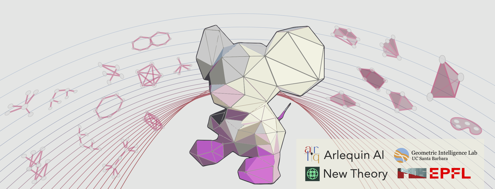
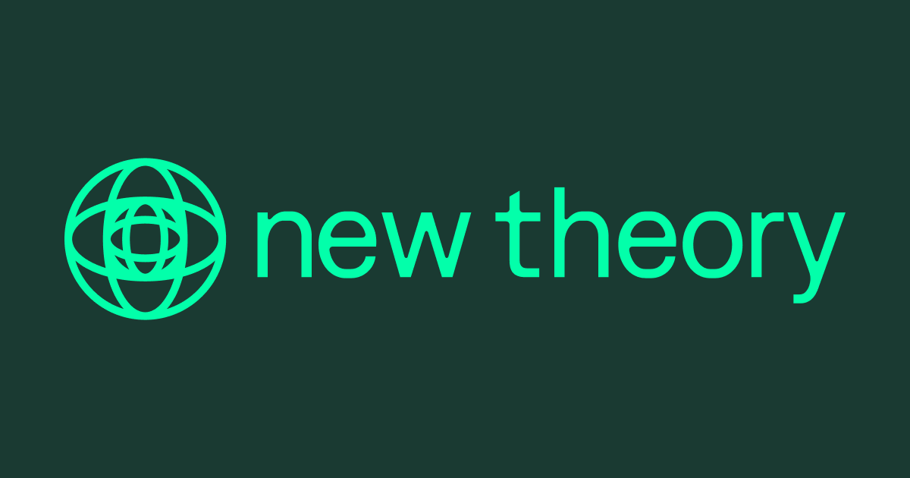

TDL Challenge 2026
-------------------

Welcome to the **Topological Deep Learning Challenge 2026: Bridging the Gap**, 
sponsored by `Arlequin AI <https://www.arlq.ai/>`__ and `New Theory <https://www.newtheory.ai/>`__, 
and hosted at the second `Topology, Algebra, and Geometry in Data Science (TAG-DS) Conference <https://www.tagds.com/events/tag-ds-2026>`__.

*Organizers:* Guillermo Bernárdez, Lev Telyatnikov, Mathilde Papillon, Marco Montagna, Louisa Cornelis, Louis Van Langendonck, Olga Fink, Nina Miolane.

.. seealso::
   Link to the challenge repository: `geometric-intelligence/TopoBench <https://github.com/geometric-intelligence/TopoBench>`__.

Motivation
----------

Despite rapid infrastructure advances and deep theoretical connections, the
**Graph Neural Network (GNN)** and **Topological Deep Learning (TDL)**
communities have largely operated in parallel. While these fields are often
treated as distinct paradigms, they are profoundly intertwined: a growing body
of work studies the interplay between standard message-passing and higher-order
representations. Yet, the broader geometric deep learning field still lacks a
unified, side-by-side comparison.

The **2026 TDL Challenge: Bridging the Gap** sets out to unite these worlds.
We invite participants to contribute and implement recent **State-of-the-Art (SOTA)** models across two dedicated
tracks: **Track 1** for GNNs, and **Track 2** for TNNs.

For the first time, the TDL Challenge will go beyond implementation to feature
a rigorous **performance analysis** of the submitted models. To achieve a
truly objective comparison, both tracks will be evaluated through a shared
pipeline powered by **TopoBench** `[Telyatnikov et al. 2025] <https://openreview.net/forum?id=07sTzyEVtY>`_ and **GraphUniverse** `[Van Langendonck et al. 2026] <https://openreview.net/pdf?id=jRWxvQnqUt>`_. By leveraging GraphUniverse's framework for generating controlled synthetic graphs, models
will be tested against specific structural properties. This will allow both
communities to gain insight on how different architectures from both domains
handle varying degrees of homophily, heterophily, and complex degree
distributions.

Through this shared benchmarking ecosystem of GNNs and TNNs, we aim to
formulate data-driven answers to long-standing scientific questions:

- **Structural Sensitivity:** How do specific graph properties (e.g., severe
  heterophily) impact the performance of classical GNNs versus their
  higher-order topological counterparts?
- **The Topological Component:** Under what specific data regimes and
  controlled environments do TDL models consistently provide unique
  capabilities over standard SOTA GNN approaches (if any)?

Description of the Challenge
----------------------------

We propose that participants implement **recent, SOTA message-passing models**
from either the GNN or TDL literature. The core objective is to rigorously evaluate how these different
architectures behave under specific, controlled topological conditions.

To achieve this, participants will integrate their models into the
**TopoBench** ecosystem and evaluate them using **synthetic datasets generated
by GraphUniverse**. By leveraging this framework, participants will conduct a
performance analysis that tests their implemented models against strict,
predefined graph properties—such as varying homophily/heterophily ratios and
complex degree distributions. We will publish a leaderboard on this website for results to be tracked live.

**Embracing Modularity.** Beyond just the core message-passing backbone, we
strongly encourage participants to take full advantage of TopoBench's modular
architecture. For example, if your chosen SOTA model relies on a novel
**feature encoder**, a specialized **readout mechanism**, or a custom **loss
function**, you can seamlessly integrate these components into the pipeline.
This will help enrich the TopoBench ecosystem with highly reusable modules for future
research across both communities. Note that no minimum training performance is required and the top-performing model might not necessarily win (see Evaluation Criteria).

To foster fair and structured comparison, the challenge is divided into two
distinct tracks:

Track 1 — Graph Neural Networks (GNNs)
~~~~~~~~~~~~~~~~~~~~~~~~~~~~~~~~~~~~~~

Focuses on **classical, pairwise message-passing architectures** operating
strictly on graph structures (e.g., modern GCNs, GATs, or deep MPNNs).

Track 2 — Topological Neural Networks (TNNs)
~~~~~~~~~~~~~~~~~~~~~~~~~~~~~~~~~~~~~~~~~~~~

Focuses on **higher-order message-passing models** that leverage rich
topological domains (e.g., Simplicial, Cellular, or Hypergraph Neural
Networks).

While the tracks are separate, both will share the **exact same evaluation
pipeline and controlled datasets**. Participants are tasked with building the
model, integrating it into the benchmarking suite, and reporting how its
performance scales across different structural regimes.

Reward Outcomes
---------------

⭐ **White paper**: Every submission that meets the requirements will be
included in a white paper summarizing the challenge's findings (planned via
PMLR through Topology, Algebra, and Geometry in Machine Learning/Data Science
2026). Authors of qualifying submissions will be offered co-authorship. [1]_

🏆 **Cash prizes**: Two winning teams (one per track) will be announced at
TAG-DS 2026 during the Awards Ceremony.

- 💰 **Track 1 (GNNs):** 1st place $1,000 USD, 2nd place $400 USD (sponsored by `New Theory <https://www.newtheory.ai/>`__).
- 💰 **Track 2 (TNNs):** 1st place $1,000 USD, 2nd place $400 USD (sponsored by `Arlequin AI <https://www.arlq.ai/>`__).
- 💰 **Honorable mentions:** $700 USD split across other outstanding submissions (additional evaluation notebook
  with further benchmarking, particularly challenging implementations, participants who submit multiple
  high-quality submissions, etc).

🌴 **Research internship — Geometric Intelligence Lab, UCSB (USA):**
A team, pending evaluation results and interest, will be invited for a visit
of up to **two months** at the Geometric Intelligence Lab, University of
California, Santa Barbara. During the visit, winners will work on cutting-edge
methods and applications of GNNs and TDL. Travel costs will be reimbursed and financial
assistance for lodging will be provided. [2]_

🏔️ **Research internship — IMOS Lab, EPFL (Switzerland):**
A team, pending evaluation results and interest, will be invited for a research 
internship at the **Intelligent Maintenance and Operations Systems (IMOS) Lab** 
at EPFL in Lausanne, Switzerland. Winners will perform research in a world-class 
academic environment. **MSc enrollment** at the time of the internship is required. 
Financial assistance for lodging will be provided; winners will likely need to 
secure a **visa** and **work authorization**.

.. note::
   Organizers reserve the right to **reallocate prize money** between tracks
   in the event of a significant disparity in the number or quality of
   submissions.

.. [1] Due to legal restrictions, U.S. researchers may be unable to co-author
   papers with scholars from certain countries or institutions. Participants
   are responsible for verifying their eligibility.

.. [2] The visit is contingent on obtaining the necessary permission to work
   in the United States and fulfilling all other legal, institutional, and
   administrative requirements.

Deadline
--------

The final submission deadline is **August 12th, 2026 (AoE)**. Participants may
continue modifying their PRs until this time.

Guidelines
----------

- **Eligibility:** Participation is free and open to all. However, for legal
  reasons, individuals affiliated with institutions that appear in the sections
  of the
  `Restricted Foreign Research Institutions <https://www.research.ucsb.edu/sites/default/files/ri/Restricted%20Foreign%20Research%20Institutions.pdf>`__
  list are not eligible for the reward outcomes of the challenge — including
  the cash prizes, internships, and co-authorship on the white paper
  summarizing the challenge findings.

- **Registration:** To participate in the challenge, participants must
  (1) open a **Pull Request (PR)** on **TopoBench** and
  (2) fill out the `Registration Google Form <https://docs.google.com/forms/d/e/1FAIpQLSedfqOwxfDOzotjgIzEUNGX7Ks2U_0941MK93CQDXd0zAsMHg/viewform>`__
  with their PR and team information. **Each submission (i.e., each PR) must be accompanied by a
  Registration Form** to be valid.

- **Picking a Model:** Please refer to the open Pull Requests in TopoBench
  (`see open PRs <https://github.com/geometric-intelligence/TopoBench/pulls>`__)
  to see which architectures are already being implemented in each track. We
  encourage a diverse representation of recent SOTA models, so please check
  open PRs to avoid duplicating efforts.

- **Submission:** For a submission to be valid, teams must:

  - Submit a valid PR before the deadline.
  - Fill out the registration form before the deadline.
  - Ensure the PR passes all integration tests for the TopoBench and
    GraphUniverse evaluation pipeline.
  - Tag the PR with the appropriate track (one of:
    ``track-1-gnn``, ``track-2-tnn``).
  - Respect all code, documentation, and submission requirements. Note: no minimum training performance is required.
  - Run the official GraphUniverse Jupyter Notebook on the implemented model and include the automatically generated results file in the PR.

- **Model Implementations:**

  - Each PR may contain **at most one** core model architecture.
  - If a model supports multiple significant variants or parameter
    configurations, the PR should include **separate configuration files** for
    each variant to ensure proper integration with the evaluation pipeline.

- **Teams:**

  - Teams are allowed, with a **maximum of 2 members**. (If you wish to form a
    larger team, please contact the organizers — see the *Questions* section —
    for discussion and approval.)
  - The same team can submit multiple models through different PRs. Make sure
    to register on the Google Form
    (`link <https://docs.google.com/forms/d/e/1FAIpQLSedfqOwxfDOzotjgIzEUNGX7Ks2U_0941MK93CQDXd0zAsMHg/viewform>`__)
    for **each PR**.
  - The same team can participate in **both** challenge tracks.

- **Early submissions:**

  - We strongly encourage participants to submit PRs early. This allows ample
    time to resolve potential integration issues with the synthetic evaluation
    datasets.
  - In cases where multiple high-quality submissions cover the **exact same
    model architecture**, earlier submissions will be given priority
    consideration.

Submission Requirements
-----------------------

A submission consists of a **Pull Request (PR)** to **TopoBench**. The PR
title must follow this format:

``Track: [Track1|Track2];  Team name: <team name>;  Model: <Model Name>``

Submissions must implement models already proposed in the literature and must cite the associated
publication or pre-print in the PR description.

Core Requirements (Both Tracks)
~~~~~~~~~~~~~~~~~~~~~~~~~~~~~~~

1. **Backbone — Required**

   Implement your model as a ``torch.nn.Module`` and store it in:

   ``topobench/nn/backbones/{domain}/{model_name}.py``

   where ``{domain}`` is one of ``graph``, ``simplicial``, ``cell``,
   ``hypergraph``, ``combinatorial``, or ``non_relational`` (Track 1 uses
   ``graph``; Track 2 uses the appropriate topological domain).

   .. note::
      The backbone is automatically discovered by TopoBench's
      ``ModelExportsManager`` — no manual registration is needed.

2. **Hydra Configuration — Required**

   Provide a YAML configuration file for your model at:

   ``configs/model/{domain}/{model_name}.yaml``

   This file must specify the full ``TBModel`` composition: ``feature_encoder``,
   ``backbone``, ``backbone_wrapper``, and ``readout``. Use an existing config
   (e.g., ``configs/model/graph/gcn.yaml`` for Track 1,
   ``configs/model/simplicial/sccnn.yaml`` for Track 2) as a template.

3. **Results as Produced by Provided Notebook — Required**

   For the first time this year, we are providing a lightweight benchmarking task to compare all
   submitted models. Run the provided Jupyter Notebook on your model at:

   ``TopoBench/2026_tdl_challenge/run_evaluation.ipynb``

   This will automatically produce a ``results.json`` file containing your model's results and
   computational complexity on the provided tasks. Your PR must include this results file. If you do
   not have access to any GPU resource, please reach out to the challenge organizers for help.

Optional Components
~~~~~~~~~~~~~~~~~~~

3. **Custom Feature Encoder** *(only if needed)*

   If your model requires non-standard input preprocessing, implement a custom
   encoder in:

   ``topobench/nn/encoders/{encoder_name}.py``

   Your encoder class must inherit from
   ``topobench.nn.encoders.base.AbstractFeatureEncoder`` and implement a
   ``forward(data)`` method returning a ``torch_geometric.data.Data`` object.
   It is automatically discovered via the ``LoadManager``.

4. **Custom Readout** *(only if needed)*

   If your model requires a non-standard output aggregation strategy,
   implement a custom readout in:

   ``topobench/nn/readouts/{readout_name}.py``

   Your readout class must inherit from
   ``topobench.nn.readouts.base.AbstractZeroCellReadOut``. It is automatically
   discovered via ``ReadoutExportsManager``.

5. **Custom Backbone Wrapper** *(only if needed)*

   If your model has non-standard output handling (i.e., the standard
   ``GNNWrapper`` or domain wrappers in ``topobench/nn/wrappers/`` are
   insufficient), implement a custom wrapper in:

   ``topobench/nn/wrappers/{domain}/{model_name}_wrapper.py``

   Your wrapper must inherit from ``topobench.nn.wrappers.base.AbstractWrapper``.

6. **Custom Loss** *(only if needed)*

   If your model requires an auxiliary or custom training loss (beyond the
   standard task loss), implement it in:

   ``topobench/loss/model/{ModelName}Loss.py``

   Your loss class must inherit from ``topobench.loss.base.AbstractLoss`` and
   implement ``forward(model_out, batch)``. It is automatically discovered via
   the ``LoadManager``. Reference it in your model config under
   ``backbone.loss._target_`` (see ``configs/model/graph/graph_mlp.yaml`` for
   an example).

Testing — Required
~~~~~~~~~~~~~~~~~~

**Unit Tests.** All contributed files must pass the pre-existing unit tests.
Any method or class not currently covered must be accompanied by new test
files placed in the appropriate subdirectory mirroring the source structure:

.. list-table::
   :header-rows: 1
   :widths: 50 50

   * - Contributed File
     - Test Location
   * - ``topobench/nn/backbones/{domain}/``
     - ``test/nn/backbones/{domain}/``
   * - ``topobench/nn/encoders/``
     - ``test/nn/encoders/``
   * - ``topobench/nn/readouts/``
     - ``test/nn/readouts/``
   * - ``topobench/loss/model/``
     - (test alongside backbone or in ``test/loss/``)

Each test file should include functions that correspond one-to-one with
contributed classes and methods (see ``test/nn/backbones/graph/test_graphmlp.py``
as an example).

TopoBench uses **Codecov** to measure coverage. Your PR must **match or exceed
93%** coverage. The Codecov report will appear as a bot comment on your PR
after CI runs.

**Pipeline Test — Required.** Fill in ``test/pipeline/test_pipeline.py`` with
your model and a compatible dataset to demonstrate that the full training
pipeline runs successfully end-to-end:

.. code-block:: python

   DATASET = "graph/MUTAG"          # or another compatible dataset
   MODELS = ["graph/your_model"]    # your config path under configs/model/

The evaluation notebook provided with the challenge must also run successfully
with your submitted model. **No minimum training performance is required** —
the goal is to evaluate architectural correctness, not accuracy.

.. note::
   The ``results.json`` produced by the evaluation notebook and committed to
   your PR feeds the :doc:`2026 Challenge Leaderboard </leaderboard/index>`.
   It is refreshed every two days from PRs labeled ``track-1-gnn`` or
   ``track-2-tnn`` — make sure your PR carries the correct label so your run
   is picked up automatically.

.. tip::
   For **Track 1** models that map directly onto PyG's standard GCN/GAT/GIN
   API, the existing ``GNNWrapper`` and ``AllCellFeatureEncoder`` can be
   reused without modification. For **Track 2** models, inspect the existing
   simplicial/cell/hypergraph wrappers in ``topobench/nn/wrappers/`` for the
   closest analog.

Evaluation
----------

Award Categories
~~~~~~~~~~~~~~~~

The top two submissions per track will be awarded cash prizes:

- **Track 1:** Best and second best **GNN model** implementations
- **Track 2:** Best and second best **TNN model** implementations

Additionally, **two teams** will be selected for **invited visits** across
both tracks based on overall quality, level of difficulty, and impact of
contribution. **Honorable mentions** will also be awarded and, for the first time this year, be given cash prizes.

Evaluation Procedure
~~~~~~~~~~~~~~~~~~~~

A panel of TopoBench maintainers and collaborators will vote using the
**Condorcet method** to select the best submission in each track.

Evaluation criteria include:

- **Correctness:** Does the submission correctly implement the SOTA model as it is described in the
  literature? Modifications to respect TopoBench computational requirements are allowed.
- **Code quality:** How readable and clean is the implementation? How well
  does the submission respect the requirements (unit tests, memory usage, and so on)?
- **Benchmark on GraphUniverse datasets:** Is the model correctly benchmarked on the GraphUniverse
  datasets as provided? Does the model produce reasonable results?
- **Documentation & tests:** Do the docstrings clearly describe the code? Do the docstrings make
  explicit references to the original equations in the paper/preprint associated to the model, and/or
  the original model implementation? Are unit tests robust?

.. important::
   These criteria do **not** reward final model performance on the dataset.
   The goal is to deliver well-written, usable model implementations and
   infrastructure that enable further experimentation and insight.

A panel of TopoBench developers and TDL experts will decide on the **two
teams to be invited for visits**, pending interest as indicated in their
Registration Forms. Internship opportunities and cash prizes are **not**
mutually exclusive.

Questions
---------

Feel free to contact the organizers at
`topological.intelligence@gmail.com <mailto:topological.intelligence@gmail.com>`__.

Related References
------------------

The following is a non-exhaustive list of recent architectures that would be
good candidates for implementation in this challenge.

Track 1: GNNs
~~~~~~~~~~~~~

- **Bundle Neural Networks (BuNN)**

  | Paper: `<https://arxiv.org/pdf/2405.15540>`__
  | Code: `<https://github.com/jacobbamb/BuNN>`__

- **Neural Sheaf Diffusion**

  | Paper: `<https://arxiv.org/pdf/2202.04579>`__
  | Code: `<https://github.com/twitter-research/neural-sheaf-diffusion>`__

- **Sheaf Neural Networks with Connection Laplacians**

  | Paper: `<https://arxiv.org/pdf/2206.08702>`__

- **Graph Foundation Models**

  | Survey: `<https://arxiv.org/pdf/2505.15116>`__
  | Repository: `<https://github.com/Zehong-Wang/Awesome-Foundation-Models-on-Graphs>`__

Track 2: TNNs
~~~~~~~~~~~~~

- **Topological Equivariant Networks**

  | Paper: `<https://arxiv.org/pdf/2405.15429>`__
  | Code: `<https://github.com/NSAPH-Projects/topological-equivariant-networks>`__

- **TopNets**

  | Paper: `<https://arxiv.org/pdf/2406.03164>`__
  | Code: `<https://github.com/Aalto-QuML/TopNets>`__

- **AirTNN**

  | Paper: `<https://arxiv.org/pdf/2502.10070>`__
  | Code: `<https://github.com/SimoneFiorellino/AirTNN>`__

- **DirSNN**

  | Paper: `<https://arxiv.org/pdf/2409.08389>`__
  | Code: `<https://github.com/ManuelLecha/DirSNN>`__

Organizers and Sponsors
-----------------------

.. rst-class:: text-center

|logo_arlq|
|logo_new_theory|
|logo_gil|
|logo_imos|

.. .. |logo_tagds_2026| image:: ../_static/logos/TAG_DS_2025_white_teal.png
..    :height: 220px
..    :alt: TAG-DS Conference 2026
..    :target: https://www.tagds.com/events/tag-ds-2026

.. |logo_arlq| image:: ../_static/logos/arlequin.png
   :height: 220px
   :alt: Arlequin AI
   :target: https://www.arlq.ai/

.. |logo_gil| image:: ../_static/logos/gil_ucsb.png
   :height: 120px
   :alt: Geometric Intelligence Lab, UC Santa Barbara
   :target: https://gi.ece.ucsb.edu/

.. |logo_imos| image:: ../_static/logos/logo_EPFL_IMOS.png
   :height: 90px
   :alt: IMOS Lab, EPFL
   :target: https://www.epfl.ch/labs/imos/
